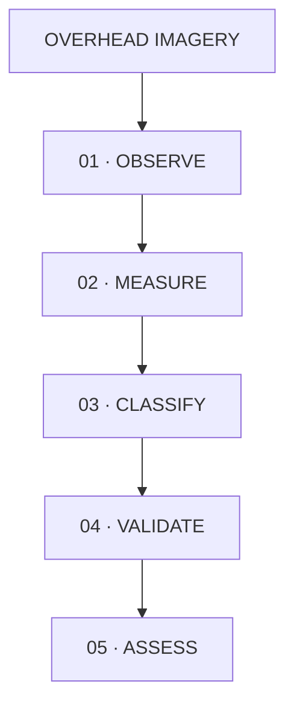
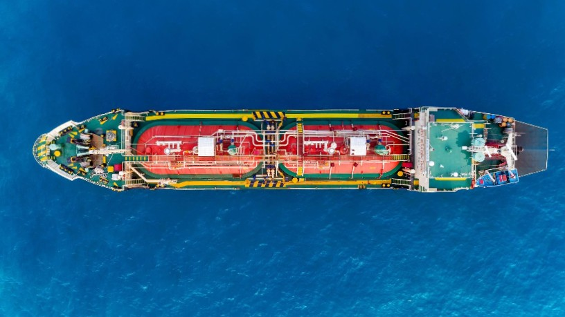
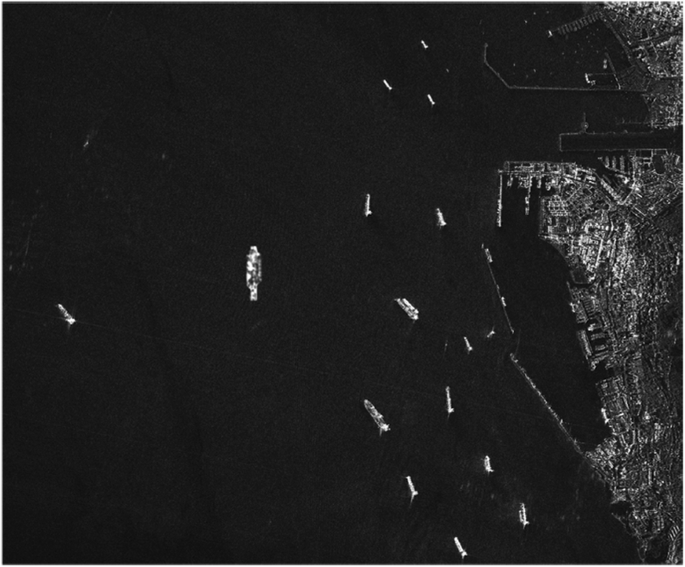
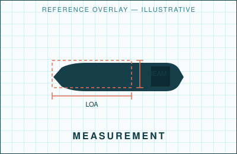
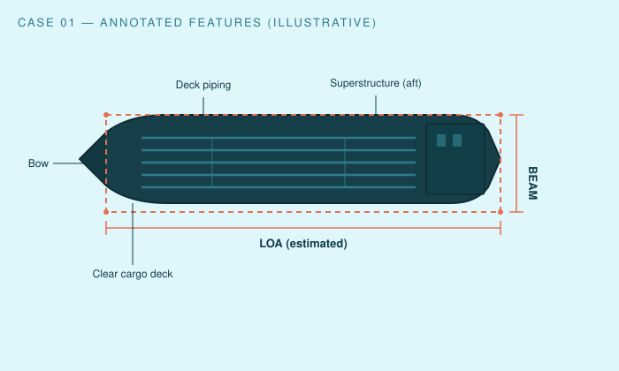
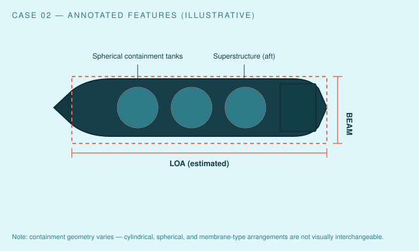
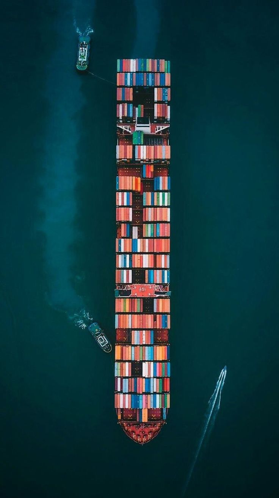

<div align="center">


# SATELLITE VESSEL INTELLIGENCE

**Detect · Measure · Classify · Verify**

*Transforming overhead imagery into structured vessel intelligence through visual analysis, dimension estimation and vessel classification.*

</div>

---

## Intelligence Question

**What can vessel structure reveal from overhead imagery?**

Overhead imagery provides observable evidence of a vessel's presence, geometry, and dimensions — its deck configuration, cargo arrangement, and superstructure. Read together, these observations support a broad vessel-class hypothesis, and, where independent maritime data is available, a more specific assessment.

The objective is not simply to identify a vessel. **The objective is to extract defensible intelligence from observable evidence.**

---

## Analytical Workflow



| Stage | Description |
|---|---|
| **01 · OBSERVE** | Identify visible vessel characteristics. |
| **02 · MEASURE** | Estimate length and beam. |
| **03 · CLASSIFY** | Determine vessel class from structural evidence. |
| **04 · VALIDATE** | Correlate imagery observations with independent maritime data where available. |
| **05 · ASSESS** | Assign classification and confidence. |

---

## Observation Layer

This portfolio demonstrates analysis across three visual perspectives. Placeholders below are original SVG illustrations — never imagery that could be mistaken for real satellite data. See [`SOURCES.md`](SOURCES.md) for data governance.

| EO / Optical | SAR | Measurement Reference |
|---|---|---|
|     |  |  |

---

## Case 01 — Crude Oil Tanker

<table>
<tr>
<td width="55%">



</td>
<td width="45%" valign="top">

**Vessel Class**
Crude Oil Tanker

**Estimated Length**
182 ± 5 m

**Estimated Beam**
29 ± 2 m

**L/B Ratio**
6.28

**Classification Confidence**
`HIGH`

**Identity Confidence**
`LOW`

</td>
</tr>
</table>

**Why this may be classified as a crude oil tanker:**

1. **Deck piping** — longitudinal transfer lines are visible along the deck, which supports the assessment of liquid cargo-handling infrastructure.
2. **Clear cargo deck** — the absence of container stacks or discrete tank domes is consistent with bulk-liquid rather than containerized cargo.
3. **Superstructure configuration** — an aft-positioned superstructure supports common tanker general arrangement.
4. **Hull proportions** — the observed L/B ratio provides supporting evidence within the range typically associated with tanker hull forms.
5. **Cargo-handling infrastructure** — manifold-style piping concentration may indicate liquid transfer capability.

None of these features is individually conclusive. Vessel configurations vary, and the assessment below reflects converging evidence rather than a single visual rule.

> **Intelligence Assessment**
> [Insert evidence-based conclusion from actual imagery]

Full write-up: [`case-studies/tanker.md`](case-studies/tanker.md)

---

## Case 02 — LPG Carrier

<table>
<tr>
<td width="55%">



</td>
<td width="45%" valign="top">

**Vessel Class**
LPG Carrier

**Estimated Length**
186 ± 5 m

**Estimated Beam**
45.5 ± 2 m

**L/B Ratio**
4.09

**Classification Confidence**
`MEDIUM`

**Identity Confidence**
`N/A`

</td>
</tr>
</table>

LPG carriers can display distinctive cargo-containment architecture — but not all LPG carriers look alike. Containment arrangements include **cylindrical tanks**, **spherical tanks** (illustrated here, Moss-type), and **other containment arrangements** such as membrane systems that sit flush within the hull. A classification hypothesis should specify which pattern was observed rather than treating "gas carrier" as one visual template.

**Core analytical lesson:** A clear cargo deck alone does not establish an oil-tanker classification.

> **Intelligence Assessment**
> [Insert evidence-based conclusion from actual imagery]

Full write-up: [`case-studies/lpg-carrier.md`](case-studies/lpg-carrier.md)

---

## Case 03 — Container Vessel

<table>
<tr>
<td width="55%">



</td>
<td width="45%" valign="top">

**Vessel Class**
Container Vessel

**Estimated Length**
298 ± 6 m

**Estimated Beam**
32.5 ± 2 m

**L/B Ratio**
9.17

**Classification Confidence**
`HIGH`

**Identity Confidence**
`LOW`

</td>
</tr>
</table>

**Why this may be classified as a container vessel:**

1. **Container stacks** — regular, box-shaped units arranged across the deck.
2. **Repetitive cargo geometry** — bay spacing repeats consistently along the hull.
3. **Cargo cranes** — where present, support a containerized-cargo hypothesis; their absence does not rule it out, since many container vessels are geared for shore-side handling.
4. **Superstructure** — aft-positioned, consistent with common container vessel arrangement.
5. **Hull proportions** — a higher L/B ratio than the tanker and LPG cases is consistent with typical container-vessel hull forms.

> **Intelligence Assessment**
> [Insert evidence-based conclusion from actual imagery]

Full write-up: [`case-studies/container-vessel.md`](case-studies/container-vessel.md)

---

## Classification Comparison

Classification is comparative: it is based on converging evidence, not a single visual cue.

| Feature | Crude Oil Tanker | LPG Carrier | Container Vessel |
|---|---|---|---|
| Clear cargo deck | Yes | No — containment structures present | No — container stacks present |
| Deck piping | Prominent, longitudinal | Limited / localized | Not primary |
| Cargo containment | N/A | Cylindrical / spherical / membrane | N/A |
| Container stacks | No | No | Yes, repetitive |
| Deck cranes | Uncommon | Uncommon | Sometimes present |
| Structural pattern | Open deck + piping | Discrete containment structures | Regular rectangular bays |
| Primary classification evidence | Piping + clear deck + hull proportions | Containment geometry + hull proportions | Container geometry + hull proportions |

---

## Confidence Framework

| Level | Meaning |
|---|---|
| **HIGH** | Multiple independent visual indicators converge and image quality is sufficient. |
| **MEDIUM** | Classification is plausible but evidence is partially obscured or ambiguous. |
| **LOW** | Evidence is insufficient, conflicting, or limited. |

**Classification confidence ≠ identity confidence.**

```
Classification Confidence: HIGH
Identity Confidence:       LOW
```

A vessel's structural class can often be assessed directly from imagery with high confidence, while its specific identity — name, IMO number, owner, flag — typically requires independent validation (AIS, registry data, vessel particulars). These are kept as separate analytical dimensions throughout this portfolio. Full discussion: [`methodology/confidence-framework.md`](methodology/confidence-framework.md).

---

## Dimension Estimation

**Length Overall (LOA)** — forward-most point → aft-most point.

**Beam** — maximum vessel breadth.

**L/B Ratio** — `LOA ÷ Beam`

Where Ground Sampling Distance (GSD) is known:

```
Physical distance = Pixel distance × Ground Sampling Distance (GSD)
```

Estimates are reported with explicit uncertainty — `182 ± 5 m`, never false precision such as `182.000 m`. Uncertainty widens with coarser image resolution, non-perpendicular vessel orientation, uncertain georeferencing, or partial occlusion. Full discussion: [`methodology/dimension-estimation.md`](methodology/dimension-estimation.md).

---

## Bounding Box Explanation

The bounding rectangle used during measurement is an **annotation and measurement aid** — it should not automatically be interpreted as the vessel's exact physical footprint. Its accuracy is limited by:

- Vessel rotation relative to the image axes
- Wake, which can extend the apparent footprint
- Shadow, which can distort apparent edges
- Image resolution
- Partial occlusion

This portfolio treats the bounding box as a tool for structured measurement, not as an automatic ground truth of vessel shape.

---

## Evidence vs. Inference

| Stage | Question |
|---|---|
| **Observation** | What is directly visible? |
| **Inference** | What does it suggest? |
| **Validation** | What independent evidence supports it? |
| **Assessment** | What conclusion is justified? |
| **Confidence** | How strong is the evidence? |

**Worked example**

- **Observation:** Longitudinal pipes are visible.
- **Inference:** Liquid-cargo transfer infrastructure may be present.
- **Classification:** Tanker hypothesis.
- **Validation:** Compare against vessel particulars, AIS, or external vessel databases.
- **Assessment:** Classification confidence increases where validation is consistent.

**A hypothesis is never presented as an observed fact.** Full discussion: [`methodology/evidence-vs-inference.md`](methodology/evidence-vs-inference.md).

---

## Technical Stack

```
EO / Optical Imagery
SAR
GIS / Spatial Measurement
Vessel Classification
AIS
Vessel Particulars
Python
Structured Data
        │
        ▼
MARITIME VESSEL INTELLIGENCE
```

The code in this repository demonstrates foundational analytical tooling — pixel-to-metre conversion, L/B ratio, and uncertainty handling — not an advanced machine-learning system. The value being demonstrated is maritime domain expertise translated into structured, correct, well-documented analysis.

### `src/measurement.py`

```python
from measurement import measurement_with_uncertainty, length_to_beam_ratio

loa = measurement_with_uncertainty(pixel_distance=364, ground_sampling_distance_m=0.5)
beam = measurement_with_uncertainty(pixel_distance=58, ground_sampling_distance_m=0.5)

print(loa)   # 182.0 ± 1.5 m
print(beam)  # 29.0 ± 1.5 m
print(length_to_beam_ratio(loa.value_m, beam.value_m))  # 6.28
```

### `notebooks/vessel-measurement.ipynb`

Demonstrates: loading measurements → converting pixels to metres → calculating L/B ratio → recording uncertainty → exporting structured results.

---

## Data

[`data/vessel-assessments.csv`](data/vessel-assessments.csv) — example / placeholder records only, using the schema:

```
vessel_id, broad_type, classification,
estimated_length_m, estimated_beam_m, lb_ratio,
detection_confidence, dimension_confidence,
classification_confidence, identity_confidence
```

No real vessel identities are represented.

---

## Methodology Documentation

- [`methodology/classification-framework.md`](methodology/classification-framework.md)
- [`methodology/dimension-estimation.md`](methodology/dimension-estimation.md)
- [`methodology/confidence-framework.md`](methodology/confidence-framework.md)
- [`methodology/evidence-vs-inference.md`](methodology/evidence-vs-inference.md)

---

## Data Governance

Only public or appropriately licensed imagery is used in this portfolio. No proprietary satellite imagery, confidential employer material, client information, internal datasets, or restricted methodologies are included. Full statement: [`SOURCES.md`](SOURCES.md).

---

## Repository Structure

```
satellite-vessel-intelligence/
├── README.md
├── SOURCES.md
├── requirements.txt
├── .gitignore
├── LICENSE
│
├── assets/
│   ├── hero/
│   │   └── portfolio-hero.svg
│   ├── vessel-01-tanker/
│   │   ├── eo.svg
│   │   ├── sar.svg
│   │   ├── measurement-overlay.svg
│   │   └── annotated-features.svg
│   ├── vessel-02-lpg/
│   │   └── annotated-features.svg
│   └── vessel-03-container/
│       └── annotated-features.svg
│
├── case-studies/
│   ├── tanker.md
│   ├── lpg-carrier.md
│   └── container-vessel.md
│
├── methodology/
│   ├── classification-framework.md
│   ├── dimension-estimation.md
│   ├── confidence-framework.md
│   └── evidence-vs-inference.md
│
├── data/
│   └── vessel-assessments.csv
│
├── notebooks/
│   └── vessel-measurement.ipynb
│
├── src/
│   └── measurement.py
│
└── styles/
    └── palette.css
```

---

<div align="center">

*This portfolio demonstrates the analytical workflow used to turn overhead imagery into structured, defensible vessel intelligence — observation, measurement, classification, validation, and assessment, with confidence stated explicitly at each stage.*

</div>
