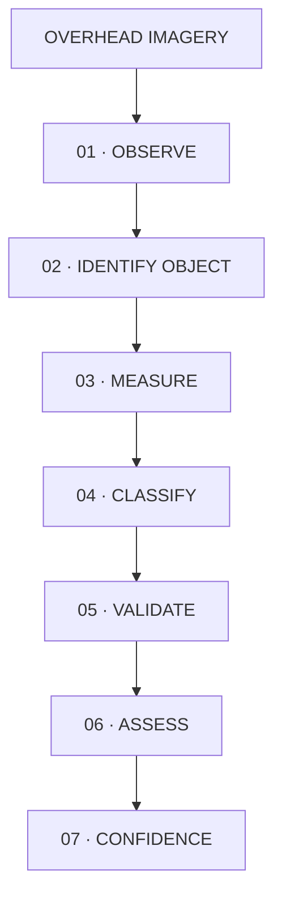
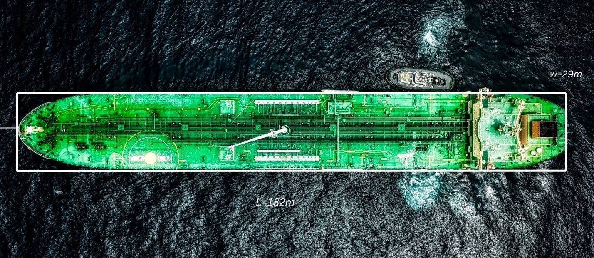
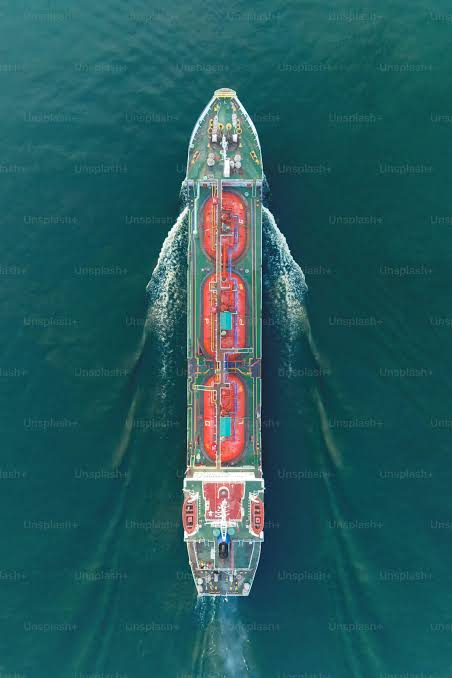
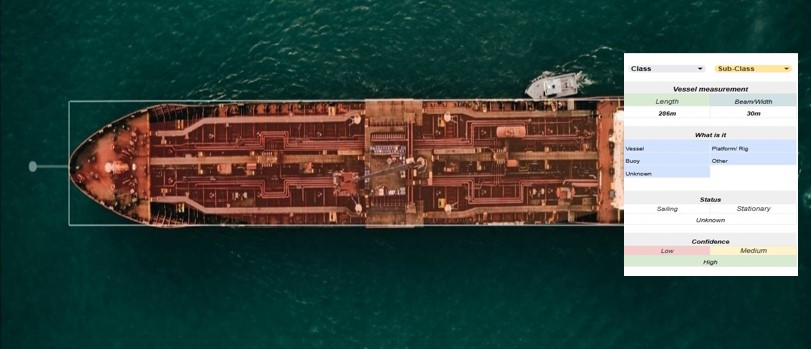
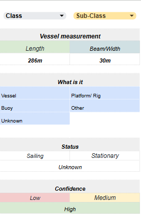
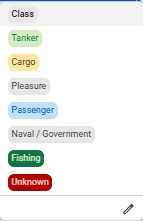
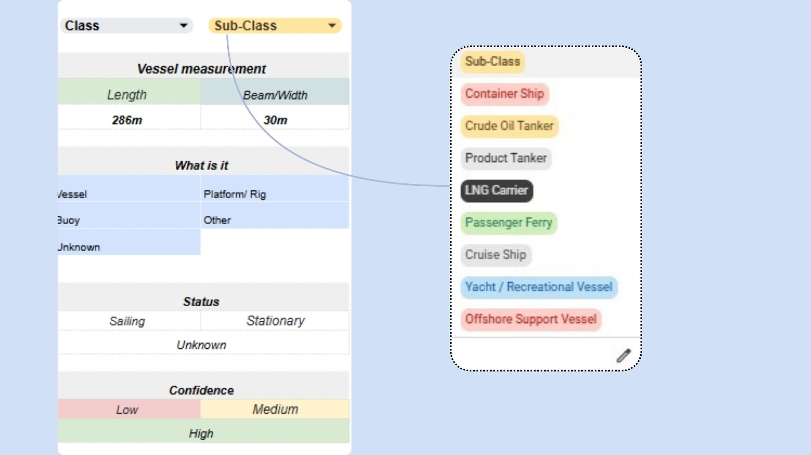
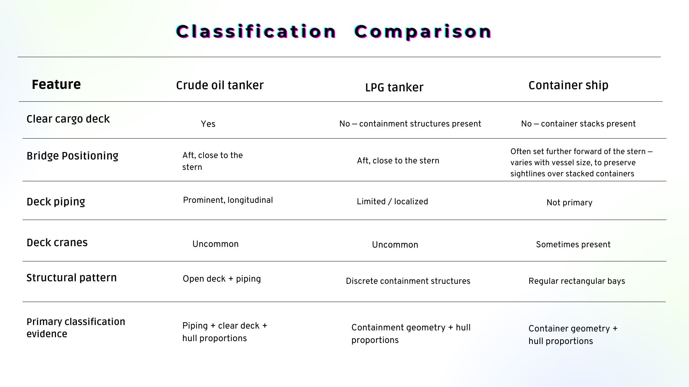

<div align="center">


# SATELLITE VESSEL INTELLIGENCE

**Detect · Measure · Classify · Validate**

*Transforming overhead imagery into structured vessel intelligence through observation, measurement, classification and independent validation.*

</div>

---

## Intelligence Question

**What can vessel structure reveal from overhead imagery?**

Overhead imagery provides observable evidence of a vessel's presence, geometry, and dimensions — its deck configuration, cargo arrangement, and superstructure. Read together, these observations support a broad vessel-class hypothesis, and, where independent maritime data is available, a more specific assessment.

---

## Analytical Workflow



| Stage | Description |
|---|---|
| **01 · OBSERVE** | Identify what it is: vessel, buoy,etc. |
| **02 · IDENTIFY OBJECT** | Identify visible vessel characteristics. |
| **03 · MEASURE** | Estimate length and beam. |
| **04 · CLASSIFY** | Determine vessel class from structural evidence. |
| **05 · VALIDATE** | Correlate imagery observations with independent maritime data where available. |
| **06 · ASSESS** | Assign classification |
| **07 · CONFIDENCE** | With all aspects met, assign confidence. |

---

## Observation Layer

This portfolio demonstrates analysis across three visual perspectives. Placeholders below are original SVG illustrations — never imagery that could be mistaken for real satellite data. See [`SOURCES.md`](SOURCES.md) for data governance.

| EO / Optical | SAR | Measurement Reference |
|---|---|---|
|     |  |  |

---

## Case 01 — Crude Oil Tanker

<table>
<tr>
<td width="55%">



</td>
<td width="45%" valign="top">

**Vessel Class**
Tanker- Likely Crude Oil Tanker

**Estimated Length**
182 m

**Estimated Beam**
29 m

**Classification Confidence**
`HIGH`

**Identity Confidence**
`LOW`

</td>
</tr>
</table>

**Why this may be classified as a oil tanker:**

1. **Deck piping** — longitudinal transfer lines are visible along the deck, which supports the assessment of liquid cargo-handling infrastructure.
2. **Clear cargo deck** — the absence of container stacks or discrete tank domes is consistent with bulk-liquid rather than containerized cargo.
3. **Superstructure configuration** — an aft-positioned superstructure supports common tanker general arrangement.
4. **Hull proportions** — the observed L/B ratio provides supporting evidence within the range typically associated with tanker hull forms.
5. **Cargo-handling infrastructure** — manifold-style piping concentration may indicate liquid transfer capability.

None of these features is individually conclusive. Vessel configurations vary, and the assessment below reflects converging evidence rather than a single visual rule.

> **Intelligence Assessment**
>
> The observed deck configuration, longitudinal piping and aft superstructure are consistent with a tanker arrangement. The available imagery supports a **crude oil tanker hypothesis**.
>
> **Class: Tanker — HIGH
> **Subclass: Likely Crude Oil Tanker — MEDIUM

Full write-up: [`case-studies/tanker.md`](case-studies/tanker.md)

---

## Case 02 — LPG Carrier

<table>
<tr>
<td width="55%">



</td>
<td width="45%" valign="top">

**Vessel Class**
LPG Carrier

**Estimated Length**
186 m

**Estimated Beam**
45.5 m

**Classification Confidence**
`MEDIUM`

**Identity Confidence**
`N/A`

</td>
</tr>
</table>

LPG carriers can display distinctive cargo-containment architecture — but not all LPG carriers look alike. Containment arrangements include **cylindrical tanks**, **spherical pressurized cargo tanks**, and **other containment arrangements**. A classification hypothesis should specify which pattern was observed rather than treating "gas carrier" as one visual template.

**Core analytical lesson:** A clear cargo deck alone does not establish an oil-tanker classification.

> **Intelligence Assessment**

>
> The observed cargo-containment structures, specialized deck configuration and vessel proportions are consistent with a **gas carrier arrangement**. The available imagery supports an **LPG carrier hypothesis**.
>
> **Classification confidence: MEDIUM 

Full write-up: [`case-studies/lpg-carrier.md`](case-studies/lpg-carrier.md)

---

## Case 03 — Container Vessel

<table>
<tr>
<td width="55%">


</td>
<td width="45%" valign="top">

**Vessel Class**
Container Vessel

**Estimated Length**
298 m

**Estimated Beam**
32.5  m

**Classification Confidence**
`HIGH`

**Identity Confidence**
`LOW`

</td>
</tr>
</table>

**Why this may be classified as a container vessel:**

1. **Container stacks** — regular, box-shaped units arranged across the deck.
2. **Repetitive cargo geometry** — bay spacing repeats consistently along the hull.
3. **Cargo cranes** — where present, support a containerized-cargo hypothesis; their absence does not rule it out, since many container vessels are geared for shore-side handling.
4. **Superstructure** — aft-positioned, consistent with common container vessel arrangement.
5. **Hull proportions** — a higher L/B ratio than the tanker and LPG cases is consistent with typical container-vessel hull forms.

> **Intelligence Assessment**
>
> The observed repetitive container-stack geometry, cargo arrangement and deck configuration are consistent with a **container vessel**. Where deck cranes are visible, their presence provides additional supporting evidence for the classification. The available imagery supports a **container ship assessment**.

> **Classification confidence: HIGH 

Full write-up: [`case-studies/container-vessel.md`](case-studies/container-vessel.md)

---

## Vessel Assessment Interface

The annotation layer is paired with a structured **vessel assessment sidebar**.

<div align="center">



</div>

The purpose is to move from:

**Image Detection → Measurement → Object Identification → Vessel Classification → Status → Confidence**

The sidebar captures the analyst's assessment immediately after the vessel or maritime object has been detected and annotated.

> **Interface concept:** The visual below represents the intended assessment workflow. In an operational implementation, the classification fields would function as selectable controls and the length/beam values would update automatically as the bounding box is adjusted.

<p align="center">
  
</p>

### Assessment Sidebar — Key

The sidebar captures the analyst's assessment immediately after the vessel or maritime object has been detected and annotated.

<div align="center">



</div>

| Field | What it captures | Example |
|---|---|---|
| **Class** | Broad vessel or maritime-object category | `Tanker` |
| **Subclass** | More specific vessel type | `Crude Oil Tanker` |
| **Length** | Estimated longitudinal dimension derived from the annotation | `182 ± 5 m` |
| **Width / Beam** | Estimated maximum breadth derived from the annotation | `32 ± 2 m` |
| **What this is** | Determines whether the detected object is a vessel or another maritime structure | `Vessel` |
| **Status** | Observed operational state at the time of imagery | `Stationary` |
| **Confidence** | Analyst's confidence in the classification assessment | `High` |

---

## 01 — What This Is

Before assigning a vessel class or subclass, the first assessment is to determine **what the detected object represents**.

Overhead maritime imagery may contain vessels alongside other objects and structures such as offshore platforms, buoys, barges, floating infrastructure, or ambiguous objects. Establishing the object type therefore forms the first decision point in the classification workflow.

#### - Object-Type Assessment

| **Selection** | **Analytical Interpretation** |
|---|---|
| **Vessel** | A floating, self-propelled or non-self-propelled craft exhibiting sufficient hull and/or superstructure characteristics to support a vessel assessment. |
| **Platform / Oil Rig** | A fixed or floating offshore installation whose structural configuration is inconsistent with a conventional vessel. |
| **Barge** | A generally flat-bottomed or cargo-oriented floating structure, typically characterized by a broad deck and limited or absent conventional vessel superstructure. |
| **Buoy** | A floating navigational, mooring, marking, or monitoring structure whose scale and configuration are inconsistent with a conventional vessel. |
| **Other** | A maritime object that does not sufficiently conform to the defined categories but can still be positively distinguished from background or environmental features. |
| **Unknown** | The available imagery does not provide sufficient evidence to determine the object's type reliably. |

**Unknown is an analytical outcome, not an analytical failure**

**Analytical principle:** Object identification precedes vessel classification. An ambiguous maritime object should not be forced into a vessel category simply because it appears on the water.

---

## 02 — Class & Sub-class

The classification hierarchy separates the **broad vessel class** from the **specific vessel subclass**.

<table>
<tr>
<td width="50%" valign="top">

**Class**

<table>
<tr>
<td width="55%">



</td>
<td width="45%" valign="top">

The various classes include:
- Cargo
- Tanker
- Passenger
- Pleasure
- Fishing
- Service / Workboat
- Naval / Government
- Other

</td>
</tr>
</table>

</td>
<td width="50%" valign="top">

**Sub-Class**

<table>
<tr>
<td width="55%">



</td>
<td width="45%" valign="top">

Examples include:
- General Cargo
- Bulk Carrier
- Container Ship
- Crude Oil Tanker
- Product Tanker
- Chemical Tanker
- LPG Carrier
- LNG Carrier
- Passenger Ferry
- Cruise Ship
- Fishing Vessel
- Tug
- Offshore Support Vessel
- Yacht / Recreational Vessel

</td>
</tr>
</table>

</td>
</tr>
</table>


The hierarchy is intentional:

> **Class = broad category**  
> **Subclass = specific vessel type**

Classification should be based on **converging structural evidence**, rather than a single visual feature.

---

#### - Classification Comparison

Classification is comparative: it is based on converging evidence, not a single visual cue.

<div align="left">



</div>

---


## 03 — Vessel Measurements

The vessel annotation provides the geometric basis for dimension estimation.

<table>
<tr>
<td width="55%">


</td>
<td width="45%" valign="top">

**Vessel Class**
Container Vessel

**Length**
Forward-most detected point → aft-most detected point.
298 ± 6 m

**Beam**
Maximum detected vessel breadth.
32.5 ± 2 m

**Classification Confidence**
`HIGH`

</td>
</tr>
</table>

---

## 04 -Vessel Status Assessment

Overhead imagery can also support an assessment of whether a vessel was underway or stationary at the time of observation. As with classification, this is a judgment supported by available evidence — not a default assumption.

| Status | Analytical Interpretation |
|---|---|
| **Sailing** | The vessel is assessed as underway based on observable indicators such as wake, position context, movement evidence, or corroborating time-series data. |
| **Stationary** | The vessel appears stationary at the time of observation, including situations such as anchorage, berth, port waiting areas, or other static positions. |
| **Unknown** | Available imagery does not provide sufficient evidence to reliably determine whether the vessel is moving or stationary. |

#### - Evidence Considerations

**Sailing**

Potential supporting indicators may include:

- Visible wake or displacement pattern
- Open-water position consistent with transit
- Sequential imagery showing positional change
- AIS or other time-series movement data, where available

**Stationary**

Potential supporting indicators may include:

- Berthing or mooring configuration
- Anchorage context
- Absence of meaningful movement across time-separated observations
- Imagery-derived assessment and AIS-derived status are separate evidence streams.

**Unknown**

Applied where:

- Only a single static image is available
- Wake characteristics are inconclusive
- Vessel position does not establish movement
- Temporal or AIS corroboration is unavailable
- Image quality prevents reliable interpretation

> **Analytical principle**
> A single image provides a snapshot, not a trajectory. Where movement cannot be demonstrated from imagery or corroborating temporal data, the appropriate assessment is **Unknown**, rather than assuming the vessel is sailing or stationary.

---

## 05 — Confidence framework


| **Confidence** | **Analytical Interpretation** |
|---|---|
| **HIGH** | Multiple independent visual indicators converge on the same classification, with sufficient image quality and structural detail to support a well-substantiated assessment. |
| **MEDIUM** | Available evidence supports the classification, but one or more indicators are partially obscured, ambiguous, or insufficiently resolved for a high-confidence assessment. |
| **LOW** | Available evidence is limited, conflicting, or insufficiently distinctive to support a reliable classification without additional imagery or corroborating data. |

> **Confidence reflects the strength and convergence of available evidence — not analyst certainty alone.**


#### - Confidence Determination

The assigned confidence level reflects the **quality, completeness, and convergence of available evidence** at the time of assessment.

> **HIGH**
>Multiple independent structural indicators.
>Key classification features clearly observable.
>No significant contradictory evidence.
>Measurement boundaries sufficiently reliable.
>Supporting external data, where available, is consistent.
> **MEDIUM**
>Classification is supported by multiple indicators.
>One or more important features are ambiguous or partially obscured.
>Alternative classifications remain plausible.
>External validation is limited or unavailable.
> **LOW**
>Few distinctive indicators.
>Significant occlusion/resolution limitations.
>Competing classifications remain plausible.
>Evidence is conflicting or insufficient.

> **Classification confidence ≠ identity confidence.**
>
> An object may be confidently classified by its observable structure while remaining unresolved at the individual-vessel identity level.

---

## 06 - Evidence vs. Inference

A vessel assessment should maintain a clear distinction between **what is directly observed**, **what is inferred from those observations**, and **what can be independently validated**.

| **Stage** | **Analytical Question** |
|---|---|
| **Observation** | What is directly visible or measurable? |
| **Inference** | What does the available evidence suggest? |
| **Validation** | What independent evidence supports or challenges the interpretation? |
| **Assessment** | What conclusion is justified by the available evidence? |
| **Confidence** | How strong, reliable, and convergent is the supporting evidence? |

 **Assumptions**

Why?

Because some analytical conclusions depend on assumptions that aren't directly observable.

Example:
- **Observation**: spherical structures visible on deck.
- **Inference**: pressurized-gas containment.
- **Assumption**: structures are cargo tanks rather than another deck installation.
- **Assessment**: likely LPG carrier.

#### Worked Example

**Observation**

Longitudinal piping is visible across the vessel's deck.

↓

**Inference**

The observed configuration may indicate liquid-cargo handling infrastructure.

↓

**Classification Hypothesis**

`Tanker`

↓

**Validation**

*Spatial validation*

Does the reported vessel position correspond to the observed object?

*Temporal validation*

Was the vessel reported at that location close enough to the imagery acquisition time?

*Structural validation*

Do vessel particulars match the observed dimensions/configuration?

*Identity validation*

Does the evidence support a specific vessel identity?

↓

**Assessment**

The tanker classification is strengthened where multiple independent indicators are consistent with the same assessment.

↓

**Confidence**

Confidence increases where evidence is sufficiently clear, distinctive, independently corroborated, and internally consistent, while remaining appropriately constrained by unresolved uncertainty.

> **Analytical principle: A hypothesis is never presented as an observed fact.**

Full discussion: [`methodology/evidence-vs-inference.md`](methodology/evidence-vs-inference.md).

---

## 07 - Intelligence Assessment

The objective of satellite vessel analysis is not simply to detect an object or assign a vessel class.

The objective is to produce a **structured vessel assessment supported by observable evidence, measurable characteristics, and independent validation where available**.

\`\`\`
DETECT → OBSERVE → IDENTIFY → MEASURE → CLASSIFY → VALIDATE → ASSESS → CONFIDENCE
\`\`\`

---

## 08 - Limitations & Failure Modes

> **Analytical Limitations**
> -Resolution may prevent discrimination between visually similar subclasses.
> -Vessel orientation affects measurement reliability.
> -Occlusion can hide classification-critical structures.
> -Single-frame imagery cannot reliably establish movement.
> -Hull proportions alone are not sufficiently distinctive for subclass identification.
> -AIS may be unavailable, delayed or inconsistent.
> -Structural appearance alone cannot establish individual-vessel identity.
> -Image-derived dimensions are estimates, not authoritative vessel particulars.
> -Synthetic/illustrative imagery should not be interpreted as operational satellite evidence.

**For Example:**

**Failure Modes**

**False tanker classification** - Clear deck + aft superstructure interpreted as tanker without sufficient cargo-handling evidence.

**False LPG classification** - Deck structures mistaken for cargo containment.

**False container classification** - Port infrastructure or stacked equipment mistaken for containers.

---

## 08 - Analytical Implementation

The analytical workflow is structured so that manual vessel assessment can be translated into reproducible data operations — from image-derived measurements and structured classification to cross-source maritime data correlation.

```text
Current implementation demonstrates structured analytical reasoning and image-derived assessment. The workflow is designed for extension into Python-based measurement, SQL-based maritime data correlation and GIS-supported spatial analysis.

```

Image
  ↓
Annotation
  ↓
Pixel measurement
  ↓
Scale conversion
  ↓
Structured JSON / CSV
  ↓
Vessel assessment
  ↓
Maritime data correlation

The analytical workflow is structured so that manual vessel assessment can be translated into reproducible data operations — from image-derived measurements and structured classification to cross-source maritime data correlation.

---

<div align="left">

*This portfolio demonstrates the analytical workflow used to turn overhead imagery into structured, defensible vessel intelligence — observation, measurement, classification, validation, and assessment, with confidence stated explicitly at each stage.*

</div>
