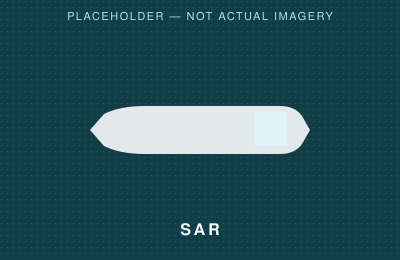

# Case 01 — Crude Oil Tanker

## Intelligence sidebar

| Field | Value |
|---|---|
| Vessel Class | Crude Oil Tanker |
| Estimated Length | 182 ± 5 m |
| Estimated Beam | 29 ± 2 m |
| L/B Ratio | 6.28 |
| Classification Confidence | HIGH |
| Identity Confidence | LOW |

## Observation layer

| EO / Optical | SAR | Measurement |
|---|---|---|
|  |  |  |

## Observation

The vessel presents a hull with a long, unobstructed cargo deck, aft-positioned
superstructure, and visible longitudinal deck piping running toward a
manifold arrangement.

## Inference

Deck piping and a clear cargo deck may indicate liquid bulk cargo-handling
infrastructure. This is consistent with — but does not alone confirm — a
tanker hypothesis.

## Supporting structural evidence

1. **Deck piping** — longitudinal transfer lines are visible along the
   deck, consistent with liquid cargo-handling.
2. **Clear cargo deck** — the absence of container stacks, cranes, or
   discrete tank domes supports a bulk-liquid rather than
   containerized-cargo assessment.
3. **Superstructure configuration** — aft-positioned superstructure is
   consistent with common tanker general arrangement.
4. **Hull proportions** — the observed L/B ratio falls within the range
   typically associated with tanker hull forms.
5. **Cargo-handling infrastructure** — manifold-style piping
   concentration provides supporting evidence for liquid transfer
   capability.

None of these features is individually conclusive; together they
converge on a tanker classification with high confidence.

## Intelligence Assessment

[Insert evidence-based conclusion from actual imagery]

## Validation

Classification confidence would typically be increased or decreased by
comparison against AIS transit patterns, vessel particulars databases, or
port call history — none of which are represented in this illustrative
case.

## Confidence

- **Classification Confidence: HIGH** — multiple structural indicators
  converge and are clearly resolvable in this illustrative imagery.
- **Identity Confidence: LOW** — no independent identity validation
  (AIS, registry, vessel particulars) has been applied in this
  illustrative example.
